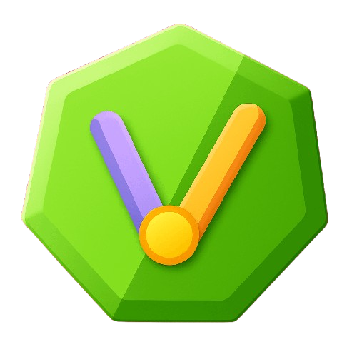

# V3rsa🛠

V3rsa is a versatile new programming language that has so much stuff,including version control,callbacks,When and WhenL,Forever,Dictionaries,Shapes,and even more.\
Fun fact:Versa was before Together Lite/Fast,before realizing its so big i gotta rebrand.\
Here is the roadmap for V3rsa so far:
***
# V3rsa Roadmap

---

## 🌱 V0.1 – Planting The Seeds

**Features:**
- Console functions: `log()`,`prompt()`,`read()`,`delete()`
- Variable declaration with `vrb`,and special characters allowed in names with `vrbs`,with limitations
- Supported types: `str`, `int`, `float`, `bool`, `maybe`(new boolean) & `null`
- Arithmetic operators: `+`, `-`, `* or ×`, `/ or ÷ or :`, `%`, `^`, `++`, `--`
- No conditionals or custom functions yet
- Uses curly brace syntax
- Functionality only, no packages yet

---

## V0.2 – ???(Coming Soon!)

---
